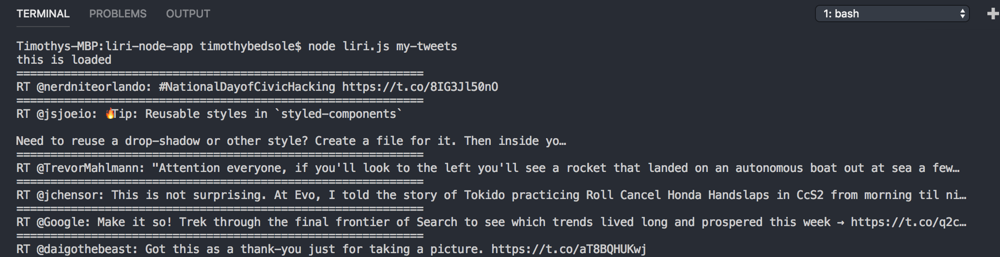
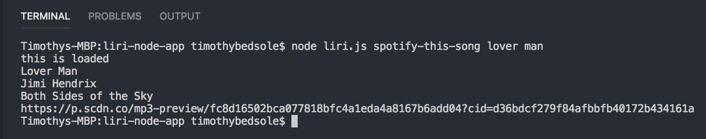
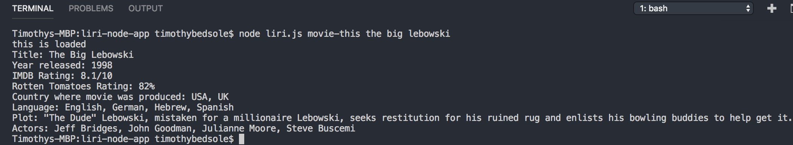
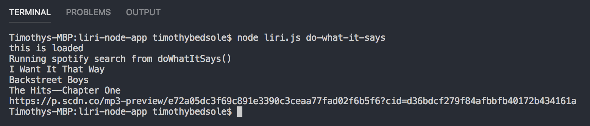

# LiriBot

This repo houses the directories and files used in the making of my solution to the node homework assignment.

This is a node.js app named LiriBot and is run entirely in the terminal. To complete this homework, I utilized the npm packages "twitter", "dotenv", "nope-spotify-api", and "request".

 There are four different commands the user may enter into LiriBot, two of which take arguments.

## my-tweets

When the my-tweets command is entered, the 20 most recent tweets from my twitter account are logged to the terminal, separated by a series of equal signs for visibility.

## spotify-this-song

The spotify-this-song command is one of two that can take in an argument. The user may enter the title of a song to get inforation of that song returned to the terminal. If the user does not enter a song, the search defaults to "The Sign".

## movie-this

The movie-this command is the second command that can take in an argument. The user may enter the title of a movie to get information returned to the terminal. If the user doesn't enter a movie, the search defaults to "Mr. Nobody".

## do-what-it-says

The do-what-it-says command does not take in arguments. When the user inputs this command, the random.txt file is read, and whatever command exists in random.txt is the command that is executed, along with any arguments if they exist.

## log.txt

As a bonus challenge for the homework, I added logic to have each command not only log the results to the console, but also append each item that is logged in the console to log.txt.